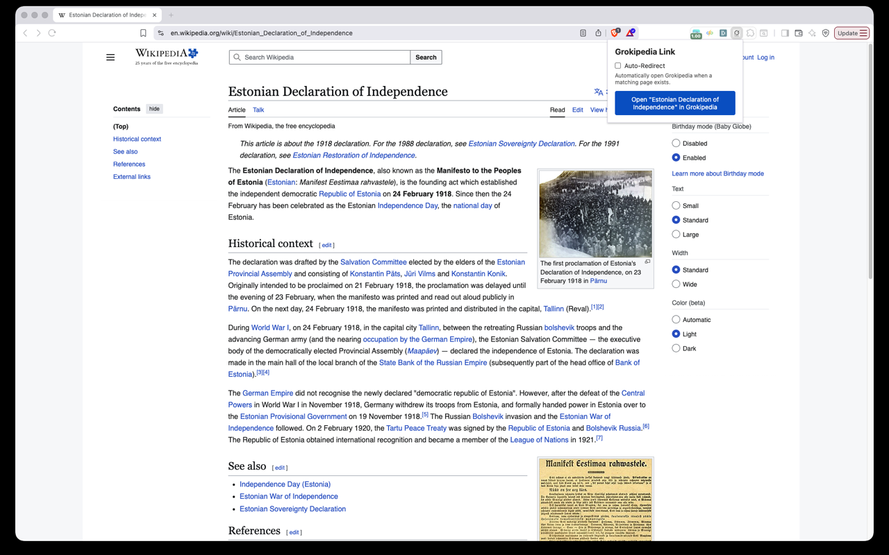

# Grokipedia Redirect

This repo is a chrome extension that creates redirect links to Grokipedia pages for Wikipedia articles.

## Install from Chrome Web Store

[Install Grokipedia Redirect](https://chromewebstore.google.com/detail/kobcggjdhkhfhhlddjkfmepjjpdnmfej?utm_source=item-share-cb)

## What does the extension do?
When you are on a Wikipedia article, it creates a link to the Grokipedia page for that article, and shows up when you click the extension icon on your browser.

It also includes an **Auto-Redirect** option in the popup:
- If Auto-Redirect is enabled and the Grokipedia page exists, the extension automatically redirects Wikipedia article tabs to Grokipedia.
- If the page is not available on Grokipedia, the popup shows `Not Available`.

## Grokipedia URL structure

- Wikipedia article: https://en.wikipedia.org/wiki/Sun-synchronous_orbit
- Grokipedia article: https://grokipedia.com/page/Sun-synchronous_orbit

## Installation (Developer Mode)

To test the extension locally in Chrome-based browsers (Chrome, Edge, Brave, etc.):

1. Clone or download this repository
   ```bash
   git clone https://github.com/nishantkumar1292/grokipedia-redirect.git
   cd grokipedia-redirect
   ```
2. Open Chrome (or your Chromium-based browser) and navigate to:
   - Chrome: `chrome://extensions/`
   - Edge: `edge://extensions/`
   - Brave: `brave://extensions/`
3. Enable Developer mode:
   - Toggle the "Developer mode" switch in the top-right corner
4. Load the extension:
   - Click "Load unpacked"
   - Select the `grokipedia-redirect` folder (the folder containing `manifest.json`)
5. The extension is now installed! Navigate to any Wikipedia article and click the extension icon to see the Grokipedia link.
6. Enjoy!!

### How it looks

Shows the popup on a Wikipedia article with the Grokipedia link ready to open:


Shows the popup on a non-Wikipedia page, where it prompts you to navigate to a Wikipedia article:


## Steps to publish to Chrome
1. Create a zip file. Run `./create_zip.sh` to create a zip file.
2. Create a Chrome Web Store developer account
    - Go to https://chrome.google.com/webstore/devconsole/
    - Sign in with your Google account
    - Pay the one-time $5 registration fee (if you haven't already)
3. Create a new item. Fill in the details, and click "Submit for Review"
